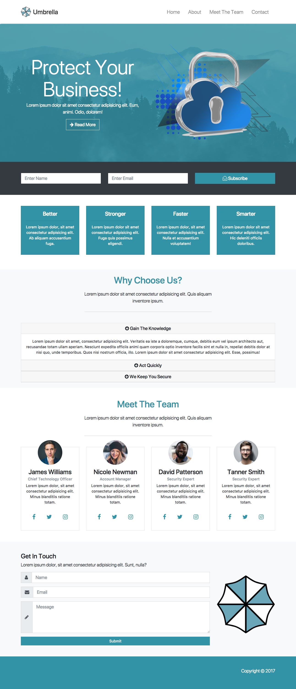

# Umbrella Bootstrap Theme
Custom Umbrella bootstrap theme built using my [Bootstap 4 Starter Pack](https://github.com/ReggEvans/bootstrap4-starter)
Learning to build websites quicker using the bootstrap framework.

## Screenshot


## Install Dependencies
```
npm install
```

## Compile Sass and Run Dev Server
```
npm start
```

Files are compiled into /src

## License
This project is licensed under the MIT License.